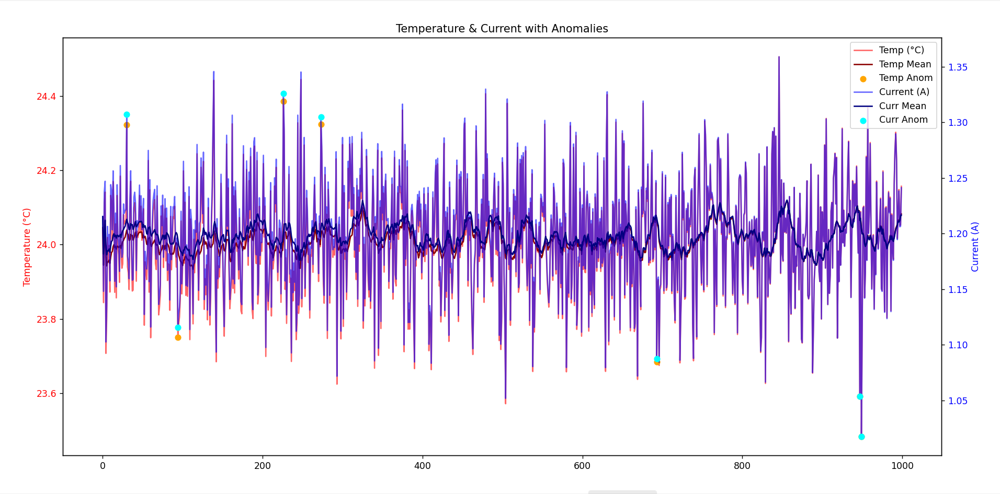
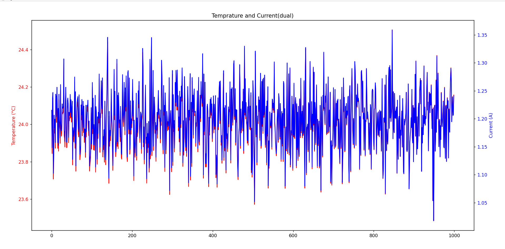

# Sensor Data Simulation & Anomaly Detection

Bu proje, **NumPy** ve **Pandas** öğrenme sürecinde geliştirdiğim küçük bir alıştırmadır.  
Amaç: sensör verisi (sıcaklık & akım) simüle etmek, rolling istatistiklerle **anomali tespiti** yapmak ve **Matplotlib** ile görselleştirmektir.  

## İçerik
`temp_sim.py` → Sıcaklık verisi simülasyonu  
`plot_temp_anomaly.py` → Sıcaklık anomaly detection + grafik  
`temp_current_sim.py` → Sıcaklık + akım üretimi  
`plot_current_anomaly.py` → Akım anomaly detection + grafik  
`merge_temp_current.py` → Temp & Current merge denemesi  
`merge_with_anomaly.py` → Merge edilmiş veride anomaly pipeline  
`temp_only.csv` → Örnek sıcaklık verisi  
`current_only.csv` → Örnek akım verisi  

## Kullanılan Kütüphaneler
[NumPy](https://numpy.org/)  
[Pandas](https://pandas.pydata.org/)  
[Matplotlib](https://matplotlib.org/)  

## Örnek Görsel
Aşağıda sıcaklık & akım verilerinde anomaly detection örneği:
  

## Not
Bu proje tamamen eğitim amaçlıdır.  
Gerçek sensör verisi yerine NumPy ile üretilmiş simülasyon verileri kullanılmıştır.  
